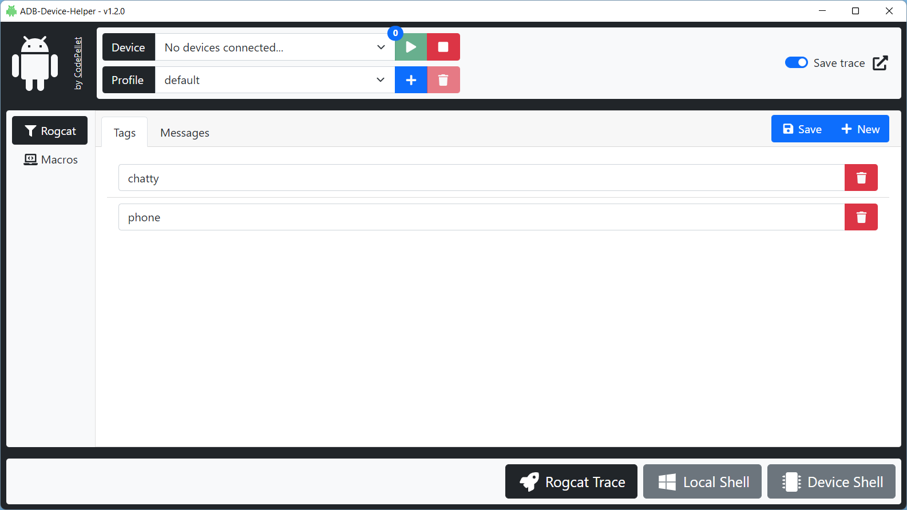

# ADB-Device-Helper

... is a UI wrapper for rogcat developed by flxo. This Helper is intended for everyone working
with the Android Debugging Bridge software and rogcat.

## Screenshots




## Features

- Connect to adb socket on localhost:5037
- Create new rogcat profiles
- Create tag and message filter for rogcat profiles
- Create and execute adb commands (macros)
- Display the command result on a result page of the Helper


## Installation

Clone repository, then run the following command in the root directory of the cloned repository.

```bash
  npm install
```

## Run Locally

Clone the project

```bash
  git clone https://github.com/CodePellet/adb-device-helper.git
```

Go to the project directory

```bash
  cd adb-device-helper
```

Install dependencies

```bash
  npm install
```

Start the Helper

```bash
  npm run start
```

## Build

Go to the project directory

```bash
  cd adb-device-helper
```
Build the Helper

```bash
  npm run build
```
**Note: Build only supports the Windows OS right now.**

## Links
Rogcat by flxo: [Repository](https://github.com/flxo/rogcat)

## License

See license in [LICENSE](./LICENSE)
